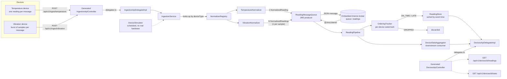

# Multi-Device Data Ingestion Prototype

A Spring Boot service that ingests data from multiple device types (a simple numeric
temperature device and a bursty vibration device), normalizes it into a common internal
representation, handles late/out-of-order data explicitly, and exposes the normalized stream
for downstream processing.

## Architecture



The REST contract is defined API-first in [openapi.yml](src/main/resources/static/openapi.yml) and
compiled into server interfaces at build time by the `openapi-generator-maven-plugin`
(`spring` generator, `delegatePattern=true`). For each OpenAPI tag this produces, per
request, a generated `@RestController` (e.g. `IngestionApiController`) that handles all
routing/binding and delegates to a `*ApiDelegate` interface (e.g. `IngestionApiDelegate`).
We implement only the delegate interfaces (`IngestionApiDelegateImpl` in
`net.kaulics.datahandler.ingestion`, `DevicesApiDelegateImpl` in
`net.kaulics.datahandler.delegate`) as plain `@Service` beans — Spring wires them into the
generated controllers automatically. Generated model classes (`Reading`, `DeviceStats`,
`IngestResponse`, `ErrorResponse`) live at the API boundary in `net.kaulics.datahandler.api`;
our internal domain model (`NormalizedReading`, `DeviceStats` in `net.kaulics.datahandler.model`)
stays independent of the API schema, with small mapping functions in `DevicesApiDelegateImpl`
converting between the two. This keeps the OpenAPI spec as the single source of truth for the
HTTP contract without leaking generated types into the domain/pipeline layers. Domain-specific
errors (e.g. `UnknownDeviceTypeException`) live in their own `net.kaulics.datahandler.exception`
package and are translated into 4xx responses by `ApiExceptionHandler`.

**Request flow**: a device posts its raw, device-specific JSON payload to
`POST /api/v1/ingest/{deviceType}`. The generated `IngestionApiController` binds the request and
calls `IngestionApiDelegateImpl`, which calls `IngestionService`. `IngestionService` looks up
the matching `DeviceNormalizer` in `NormalizerRegistry` (keyed by device type), converts the
raw JSON into the typed payload, validates it (Bean Validation), and normalizes it into one or
more `NormalizedReading`s — the common internal model shared by every device type. Each
reading is then published to `ReadingMessageQueue`, which sends it as a JSON message on a JMS
queue backed by an embedded Apache ActiveMQ Artemis broker (no external broker process needed).
A `@JmsListener` on the same class receives the message and runs `ReadingPipeline`,
which classifies each reading for lateness via `OrderingTracker`, stores accepted readings in
`ReadingStore` (kept sorted by event time), and fans it out to any number of
`DownstreamConsumer`s (currently `DeviceStatsAggregator`, which keeps running
min/max/average/late/dropped counts per device). Two read endpoints expose this data:
`GET /api/v1/devices/{id}/readings` and `GET /api/v1/devices/{id}/stats`. Since processing is
asynchronous, a reading may not be immediately visible on these endpoints right after the ingest
call returns (eventual consistency, as with any real message broker). The queue runs inline on
the caller's thread instead when `pipeline.async.enabled=false` (set in tests for deterministic,
immediately-visible results, avoiding a broker round-trip per test).

A `DeviceSimulator` (`@Scheduled`) periodically feeds synthetic temperature readings and
vibration bursts through the same ingestion path so the system is demonstrably runnable
without real hardware. It is disabled in tests (`simulation.enabled=false`).

### Adding a new device type

1. Add a payload record (e.g. `HumidityPayload`) with Bean Validation annotations.
2. Implement `DeviceNormalizer<HumidityPayload>` as a `@Component`, returning its
   `deviceType()`, `payloadType()`, and `normalize(...)` logic.

That's it — `NormalizerRegistry` picks it up automatically via Spring's component scanning, and
`POST /api/v1/ingest/humidity` starts working with no changes to the generated controller,
delegate, service, pipeline, store, or stats aggregator. This is the main "no major
restructuring" guarantee: the generic dispatch (`IngestionApiDelegateImpl` → `IngestionService`
→ `NormalizerRegistry`) never references a concrete device type.

## Key assumptions

- Each device produces readings with an explicit event timestamp (device clock), separate from
  when the service receives them (`ingestTime`). Real deployments would need to consider clock
  skew between devices and the server; this prototype assumes device clocks are reasonably
  synchronized (e.g. NTP).
- "Downstream processing" is satisfied by (a) a queryable, time-ordered in-memory store and
  (b) a simple running-stats aggregator, fed via a JMS queue on an embedded Artemis broker -
  a real message broker, just running in-process instead of as a separate service. The
  `DownstreamConsumer` interface is the seam where additional consumers would plug in without
  touching the pipeline.
- Device and reading identity is a simple string `deviceId`; no auth/multi-tenancy is
  implemented (out of scope for this exercise).
- All state is in-memory and single-instance; restarting the service loses ingested data. This
  is acceptable per the assignment's "in-memory approach is completely acceptable" guidance.


## Late / out-of-order data handling

Each device has a **watermark**: the latest event time seen so far for that device
(`OrderingTracker`). Every incoming reading is classified against it:

- **On time** (`eventTime >= watermark`): accepted, watermark advances to `eventTime`.
- **Late** (`watermark - allowedLateness <= eventTime < watermark`): still accepted and stored
  (flagged `late = true` and counted separately in stats), but the watermark does **not** move
  backwards. `allowedLateness` is configurable (`ingestion.allowed-lateness`, default `PT30S`).
- **Dropped** (`eventTime < watermark - allowedLateness`): too old to reasonably reorder into
  recent downstream aggregates, so it is rejected and counted as `droppedCount` rather than
  silently corrupting recently-computed stats.

Regardless of arrival order, `ReadingStore` keeps readings sorted by event time per device
(`ConcurrentSkipListMap`), so any accepted reading — on time or late — ends up in the correct
chronological position for downstream consumers reading the store.

## Large-payload (bursty) device handling

The vibration device sends **one HTTP message per burst** (e.g. 50-1000 samples at a high
sample rate) rather than one message per sample, to avoid a flood of tiny requests from a
high-frequency sensor. `VibrationNormalizer` expands each burst into one `NormalizedReading`
per sample, deriving each sample's precise event time from `baseTimestamp + index /
sampleRateHz`. From that point on, the rest of the pipeline (ordering, storage, stats) treats
each sample as an independent reading identical in shape to a temperature reading - the burst
structure is an ingestion-time concern only, not a pipeline-wide one.

## Running

```bash
./mvnw spring-boot:run
```

Example requests:

```bash
curl -X POST localhost:8080/api/v1/ingest/temperature \
  -H 'Content-Type: application/json' \
  -d '{"deviceId":"temp-1","timestamp":"2024-01-01T00:00:00Z","celsius":21.5}'

curl -X POST localhost:8080/api/v1/ingest/vibration \
  -H 'Content-Type: application/json' \
  -d '{"deviceId":"vib-1","baseTimestamp":"2024-01-01T00:00:00Z","sampleRateHz":1000,"samples":[0.1,0.2,0.3]}'

curl localhost:8080/api/v1/devices/temp-1/readings
curl localhost:8080/api/v1/devices/temp-1/stats
```

## Tests

```bash
./mvnw test
```

Covers normalizers, the normalizer registry, the ordering/lateness tracker, the reading store,
the stats aggregator, the pipeline, the ingestion service (including validation and error
paths), the device simulator, and end-to-end controller tests (MockMvc) for both ingestion and
query endpoints.
# datahandler
